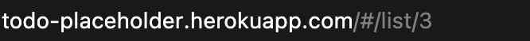
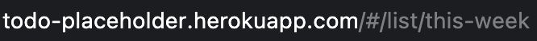
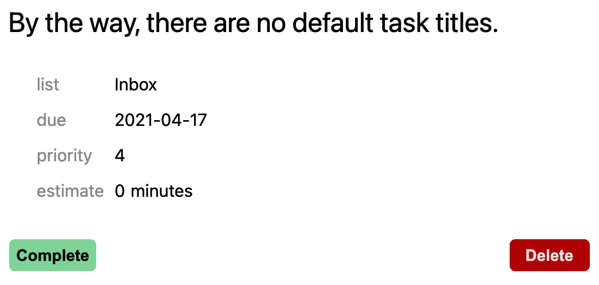
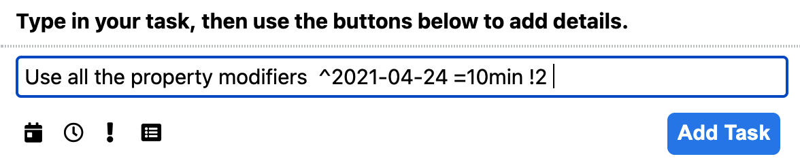
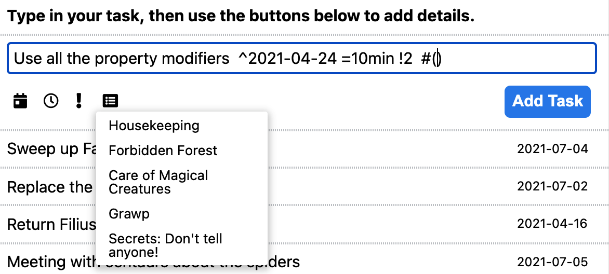
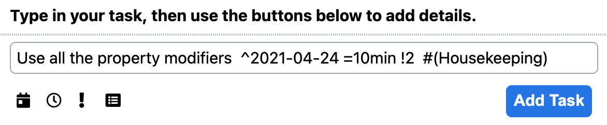
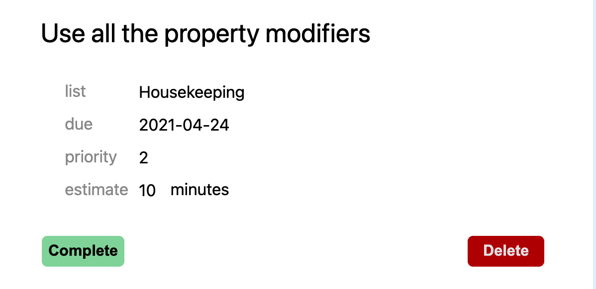

**README.md**


**An app that remembers the little things for you.**

# Introduction
Turn Off The Stove is a Rails-React-Redux clone of Remember the Milk, a to-do list website. Users can create tasks, organize them into lists, and Turn Off The Stove will keep track of which tasks need to be done soon.


# Technologies Used
* Ruby / Rails
* PostgreSQL
* React.js
* Redux
* AJAX
* JBuilder
* JavaScript
* Webpack
* Regex
* HTML5 / CSS3

# Main Features

### Tasks Query 
Tasks are fetched depending on which list the user is viewing. The Today, Tomorrow, and This Week lists are built-in for each user. All queries only fetch items belonging to the current user to ensure separation of users. 


The app reads the `:listId` wildcard from the URL to construct its query. A user-generated list is represented by its numeric `id` while the standard built-in lists are identified by a keyword. 


<br />

<br />


The React component constructs query parameters and sends it to the Rails controller in an AJAX request. For the built-in lists (e.g. This Week), the controller fires a different query structure based on a `custom` parameter. The `complete` parameter is also included to filter between complete and incomplete tasks. Below is the Rails code that converts the payload from the AJAX request into a format recognizeable by the ActiveRecord API:
```ruby
def custom_params
    type = params[:task][:custom]
    complete = params[:task][:complete]
    case type
    when 'inbox'
      # finding the uncategorized tasks
      conditions = [
        'list_id IS NULL AND user_id=? AND complete=?',
        current_user.id,
        complete
      ]
    when 'today'
      conditions = [
        'due_date=? AND user_id=? AND complete=?',
        DateTime.current,
        current_user.id,
        complete
      ]
    when 'tomorrow'
      conditions = [
        'due_date=? AND user_id=? AND complete=?',
        DateTime.current.advance(days: 1),
        current_user.id,
        complete
      ]
    when 'this-week'
      #finding tasks due in the coming week
      conditions = [
        'due_date BETWEEN ? and ? AND user_id=? AND complete=?',
        DateTime.current,
        DateTime.current.advance(weeks: 1),
        current_user.id,
        complete
      ]
    else
      #if type does not match the above, it is not trustworthy, delete it.
      conditions = [];
    end

    #create the query using the conditions created by the case-when block above
    ActiveRecord::Base.send(:sanitize_sql_array, conditions)
  end
  ```


  ### Task Creation
  Users are able to create tasks and attach properties on them such as due dates and time estimates. If no properties are specified at the time, default values are used:
  
  <br />

  At the time of creation, users can input special modifier characters to signal a property to add. Below would be the notation to set a due date of April 24, with an estimate of 10 minutes, at priority 2.
  
  <br />

  The user can just use the buttons below to insert the modifier characters, and even some preset values:
  
  <br />

  which is especially handy for dates and lists.
  
  <br />

  Ta-da!
  


RegEx pattern matching is utilized to translate the user's input into key-value pairs recognizable by the Rails controller's strong params:
``` javascript
export const parseInput = (input, lists) => {
  let titleMatch = input.match(/((?:\w|\s)+)(?:\s\W)?/)
  let title = titleMatch[1]
  let task = {title};

  let dueDateMatch = input.match(/\^(.*)/);
  if (dueDateMatch) {
    let dueDate = parseDate(dueDateMatch[1])
    task.dueDate = dueDate;
  };

  let listMatch = input.match(/#\((.+)\)/);
  if (listMatch) {
    let listTitle = listMatch[1];
    let listObj = lists.find(list => list.title === listTitle);
    let listId = listObj.id;
    task.listId = listId; 
  }

  let priorityMatch = input.match(/!([1-4])/);
  if (priorityMatch) {
    let priority = priorityMatch[1];
    task.priority = priority;
  }

  let estimateMatch = input.match(/=(\d+)min/);
  if (estimateMatch) {
    let estimate = estimateMatch[1];
    task.estimate = estimate;
  }

  //output is an object with up to 5 key-value pairs depending on which regex matches are found
  return task;
}
```


# Special Mentions

Vector art in the logo was created by <a href="https://www.freepik.com/vectors/water">brgfx (www.freepik.com)</a>

The folks at <a href="https://www.regexone.com">RegexOne</a> who created interactive tutorials to walk you step-by-step through the most common selector types and how to use them. Also, the folks at <a href="https://regex101.com">regular expressions 101</a> who put together an online regex editor that visualizes what the regex is matching and capturing. 