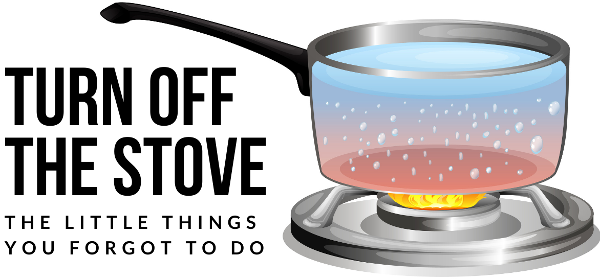
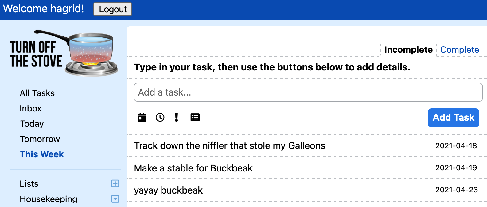

**README.md**

**An app that remembers the little things for you.**

# Introduction
Turn Off The Stove is a Rails-React-Redux clone of Remember the Milk, a to-do list website. Users can create tasks, organize them into lists, and Turn Off The Stove will keep track of which tasks need to be done soon.

# Technologies Used
* Ruby / Rails
* React.js
* Redux
* AJAX
* JBuilder
* JavaScript
* Webpack
* HTML5 / CSS3

# Main Features

### Tasks Query 
Tasks are fetched depending on which list the user is viewing. The Today, Tomorrow, and This Week lists are built-in for each user. 

The app reads the `:listId` wildcard from the URL to construct its query. A user-generated list is represented by its numeric `id` while the standard built-in lists are identified by a keyword. 